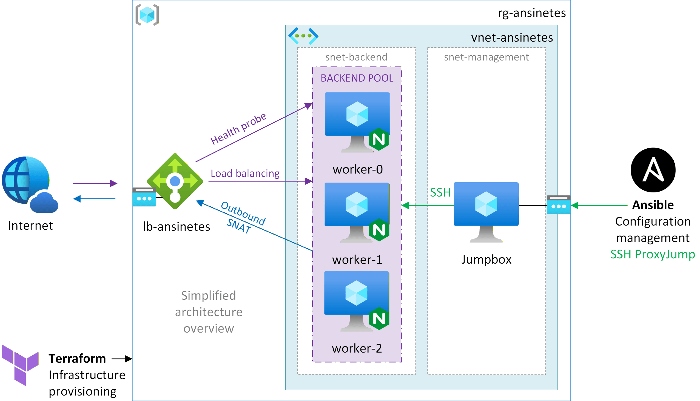

# 🏭 Ansinetes

<a href="https://github.com/pathei-kosmos/ansinetes/actions/workflows/ci.yml"></a>

**Automated deployment of [nginx](https://nginx.org/en/) web servers behind an Azure Load Balancer.**

Infrastructure is provisioned using [Terraform](https://www.terraform.io/), then the private machines are configured using [Ansible](https://www.ansible.com/) through a jumpbox.



The workers only have private IP addresses. The jumpbox is the only virtual machine exposed for SSH access. The load balancer also provides outbound connectivity to the workers.

## 🔧 Requirements

* [Terraform](https://developer.hashicorp.com/terraform/install)
* [Azure CLI](https://learn.microsoft.com/en-us/cli/azure/install-azure-cli)
* [Ansible](https://docs.ansible.com/ansible/latest/installation_guide/intro_installation.html)

## 🛠️ Setup

Clone the repo:

```bash
git clone https://github.com/pathei-kosmos/ansinetes.git
cd ansinetes
```

Initialize the Terraform project:

```bash
terraform init
```

## 🚀 Usage

Start by connecting Azure CLI to the Azure subscription you want to use for deployment:

```bash
az login
```

Copy the example variables file:

```bash
cp terraform.tfvars.example terraform.tfvars
```

Three variables need to be set:

* `subscription_id`: ID of the Azure subscription to use for deployment.
* `admin_cidr`: public IPv4 CIDR allowed to connect to the jumpbox over SSH, for example `203.0.113.10/32`.
* `admin_ssh_public_key`: public SSH key used to connect to the virtual machines.

The syntax of the `terraform.tfvars` file is as follows:

```hcl
subscription_id      = "xxxxxxxx-xxxx-xxxx-xxxx-xxxxxxxxxxxx"
admin_cidr           = "203.0.113.10/32"
admin_ssh_public_key = "ssh-ed25519 AAAA..."
```

You can then check the resources to be deployed:

```bash
terraform plan
```

If everything looks fine, start the deployment:

```bash
terraform apply
```

Once the infrastructure is deployed, generate the Ansible inventory from the Terraform outputs:

```bash
terraform output -raw ansible_inventory > playbooks/inventory.ini
```

Then configure the nginx workers:

```bash
ansible-playbook -i playbooks/inventory.ini playbooks/nginx.yml
```

Ansible connects to the private workers through the jumpbox using SSH ProxyJump.

If your SSH key is not automatically detected, specify it manually:

```bash
ansible-playbook -i playbooks/inventory.ini playbooks/nginx.yml --private-key ~/.ssh/id_ed25519
```

## 🧪 Verification

The public IP address of the load balancer can be retrieved with:

```bash
terraform output -raw load_balancer_ip
```

You can then query the nginx servers:

```bash
curl "http://$(terraform output -raw load_balancer_ip)"
```

Each worker serves a page containing its hostname.

## 🧹 Cleanup

To delete the deployed resources:

```bash
terraform destroy
```
