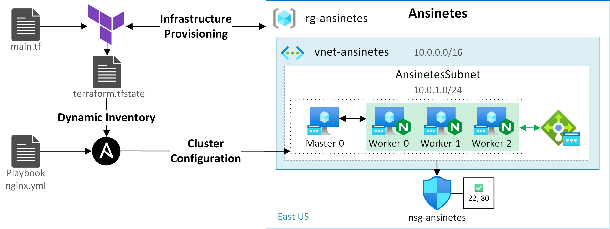

# :factory: Ansinetes

<p align="center">
  
</p>

Automated deployment of an [nginx](https://nginx.org/en/) cluster served by a load balancer. Provisioning is done in the Azure Cloud using [Terraform](https://www.terraform.io/), the machines are then configured using [Ansible](https://www.ansible.com/).

# Requirements

* [Terraform](https://developer.hashicorp.com/terraform/install)
* [Azure CLI](https://learn.microsoft.com/en-us/cli/azure/install-azure-cli)

# Setup

Clone the repo:

```
git clone https://github.com/pathei-kosmos/ansinetes.git
cd ansinetes
```

Initialize the Terraform project:

```
terraform init
```

# Usage

Start by connecting Azure CLI to the Azure subscription you want to use for deployment:

```
az login
```

Create a ```terraform.tfvars``` file in the project root.

Two variables need to be [overridden](https://developer.hashicorp.com/terraform/language/values/variables#assigning-values-to-root-module-variables): 
- ```subscription_id``` : for the ID of the Azure subscription you wish to use for deployment (its explicit mention is [mandatory since AzureRM version 4.0](https://registry.terraform.io/providers/hashicorp/azurerm/latest/docs/guides/4.0-upgrade-guide#specifying-subscription-id-is-now-mandatory)). Your subscription ID can be found with the ```az account show``` command (“id” field).
- ```vm_password``` : to define the password of the virtual machines' administrator account.

The syntax of the ```terraform.tfvars``` file is as follows:

```
subscription_id = "xxxxxxxx-xxxx-xxxx-xxxx-xxxxxxxxxxxx"
vm_password     = "xxxxxxxxxxxxx"
```

You can then check the resources to be deployed:

```
terraform plan
```

If everything looks fine, you can start the deployment:

```
terraform apply
```

To delete the deployed resources:

```
terraform destroy
```